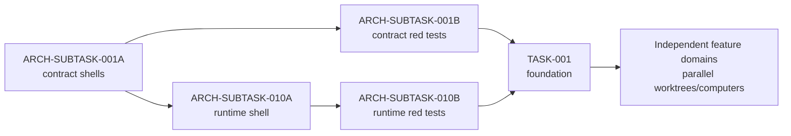

# Agent Orchestration

[Agent rules](../AGENTS.md) ·
[Feature tasks](../Tasks/README.md) ·
[Architecture tasks](../Architecture/Tasks/README.md) ·
[Implementation sequence](../Architecture/Plans/Implementation-Sequence.md)

This folder turns the human-readable plan into a schedule that Codex and Claude
can follow consistently. `task-graph.json` is the scheduling source of truth.
Task Markdown remains the source of requirements, scope, acceptance criteria,
and evidence.

## Why One Coordinator

One coordinator owns task status, claims, leases, and integration. Workers do
not select their own next task. This prevents two agents from editing the same
Blueprint, map, config, or task board while still allowing independent modules
to proceed in parallel.

The coordinator may have at most three worker/reviewer agents active at once.
The primary context remains available to validate claims, answer blockers, and
integrate results.

## Milestones and Status

| Status | Meaning | Authority |
|---|---|---|
| `BLOCKED` | A `start_after` edge is unsatisfied | Coordinator |
| `READY` | All start edges are satisfied; task may be claimed | Coordinator |
| `IN_PROGRESS` | One owner holds the claim and leases | Coordinator/worker |
| `REVIEW_READY` | Implementation and evidence are complete at an immutable commit | Worker |
| `IN_REVIEW` | A fresh context is reviewing that commit | Coordinator/reviewer |
| `CHANGES_REQUESTED` | Reviewer returned actionable findings | Reviewer |
| `DONE` | Review is approved and all `done_after` edges are satisfied | Coordinator |

`start_after` is an authorization to begin. `done_after` is a completion gate.
A `review_ready` milestone is reached by `REVIEW_READY`, `IN_REVIEW`, or `DONE`;
a `done` milestone is reached only by `DONE`.

## Coordinator Loop

1. Run `../Scripts/Test-AgentTaskGraph.ps1`.
2. Run `../Scripts/Get-AgentReadyTasks.ps1`.
3. Select only a task whose task file is `READY`.
4. Compare its proposed exact paths and lease keys with every active claim.
5. Create a dedicated branch and worktree/checkout for a mutating worker.
6. Record the claim using [the claim template](Claim-Template.md).
7. Commit and push the claim before another computer starts.
8. Dispatch a worker with only the task, architecture links, claim, and base SHA.
9. Require the [implementation handoff](Implementation-Handoff-Template.md).
10. Dispatch [independent review](Review-Handoff-Template.md) in a new context
    against the immutable implementation commit.
11. Return findings to the implementation context, or mark the task `DONE`.
12. Release leases and update the human-readable boards after integration.

When two computers race to claim the same task, only the first pushed claim is
valid. The losing worker must stop without touching production assets.

## Parallelism Rules

Parallel mutating tasks require:

- separate worktrees/checkouts and branches;
- disjoint exact source/asset paths;
- disjoint lease keys;
- separate Unreal Editor/MCP sessions;
- a declared integration order for converging outputs.

Agents in the same checkout may run read-only discovery and review concurrently.
They must not edit, stage, commit, or update status.

Typical early sequence:

The detailed, machine-checked ordering is in
[`task-graph.json`](task-graph.json).

## Codex

Codex reads the root `AGENTS.md` and project agents in `.codex/agents/`.
Start an implementer with `risbacka_worker` and a review with
`risbacka_reviewer`. The coordinator must provide the exact task and claim;
the agent must not infer either.

Suggested coordinator instruction:

> Read AGENTS.md and Agent-Orchestration/README.md. Validate the task graph,
> list ready work, and claim only non-overlapping tasks. Use separate
> worktrees for mutating workers. After each immutable implementation handoff,
> start a fresh reviewer context. Do not integrate unapproved work.

## Claude

Claude reads `CLAUDE.md`, which imports the same root `AGENTS.md`. Project
subagents live in `.claude/agents/`. Use `risbacka-worker` for implementation
and `risbacka-reviewer` for a new-context review.

If a built-in Explore or Plan agent is used, repeat the crucial task ID,
read-only scope, and Git/status prohibitions in its prompt because those
built-in agents may not load project instructions.

## Multiple Computers

Each computer uses its own checkout and task branch. Before work:

1. fetch the latest coordinator branch;
2. confirm the pushed claim names this computer and branch;
3. confirm the base SHA;
4. acquire any required LFS locks;
5. run graph validation locally.

Workers push only their assigned branch. The coordinator integrates reviewed
commits in dependency order. Never amend, squash, rebase, or force-push an
implementation commit while it is under review.

## Current Checkout

Do not begin implementation from a checkout containing uncommitted planning or
unrelated Unreal changes. First establish a clean, shared documentation
baseline, then create worktrees from its commit. Read-only planning and graph
validation remain safe.
