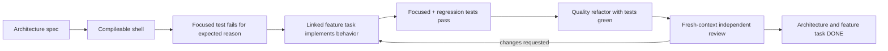

# Architecture Implementation Sequence

[Architecture home](../README.md) · [Architecture tasks](../Tasks/README.md) ·
[Feature crosswalk](../Feature-Task-Crosswalk.md)

## Definition of an Increment

Each architectural increment follows the same gated flow:

An agent must not skip the red result by implementing behavior while creating the
shell. A reviewer must not be the implementation context.

## Stage 0 — Contract Foundation

Architecture task: [ARCH-TASK-001](../Tasks/01-contracts/ARCH-TASK-001-contracts.md)

1. Create the game-owned `Core/Contracts` folders.
2. Create compileable interface, enum, and struct shells.
3. Separate `E_RisbackaPhase` from `E_RisbackaRunState`.
4. Create contract test doubles and red contract tests.
5. Allow [TASK-001](../../Tasks/01-foundation/TASK-001-foundation.md) to implement the
   game-owned baseline.
6. Review in a fresh context.

No feature module starts before the contracts it consumes have a compileable shell.

## Stage 1 — Runtime and Composition Shell

Architecture task:
[ARCH-TASK-010](../Tasks/02-runtime-composition/ARCH-TASK-010-runtime-composition.md)

Create shells for `BP_RunCoordinator`, `BP_PlayerLifeAggregator`, and
`BP_RisbackaWorldBootstrap`. Tests first prove invalid initialization, transition
arbitration, and repeat initialization. [TASK-001](../../Tasks/01-foundation/TASK-001-foundation.md)
and later [TASK-090](../../Tasks/10-integration/TASK-090-integration.md) make them green.

## Stage 2 — Parallel Domain Shells and Tests

After Stage 0 contracts and the minimal runtime context compile, different agents may
work in parallel:

| Architecture gate | Modules | Linked implementation |
|---|---|---|
| [ARCH-TASK-020](../Tasks/03-camera/ARCH-TASK-020-camera.md) | Camera & Local Co-op | TASK-010 |
| [ARCH-TASK-030](../Tasks/04-cycle-waves/ARCH-TASK-030-cycle-waves.md) | Cycle and Waves | TASK-020, TASK-060 |
| [ARCH-TASK-040](../Tasks/05-health-ai/ARCH-TASK-040-health-ai.md) | Health/Objectives and Enemy AI | TASK-030, TASK-050 |
| [ARCH-TASK-050](../Tasks/06-resources-building/ARCH-TASK-050-resources-building.md) | Resources and Building | TASK-040, TASK-070 |

Each agent owns only its declared folder and test fixtures. Shared player/GameMode
hookups wait for the lease sequence in [Tasks](../../Tasks/README.md).

## Stage 3 — UI Contract

Architecture task: [ARCH-TASK-060](../Tasks/07-ui/ARCH-TASK-060-ui.md)

UI shell/tests begin after runtime producers expose stable snapshots and events. Fake
read sources make the HUD tests independent of the prototype map. TASK-080 then makes
the presentation green.

## Stage 4 — Composition and Full Loop

Architecture task:
[ARCH-TASK-070](../Tasks/08-integration-review/ARCH-TASK-070-integration-review.md)

TASK-090 assembles only reviewed module APIs in `L_Risbacka_Prototype`. It must not
repair feature internals in the Level Blueprint. Integration defects return to the
owning module/task with a focused regression test.

TASK-100 adds cross-module automation and the two-controller acceptance run.

## Stage 5 — Independent Acceptance

A fresh reviewer:

1. reads architecture and feature requirements;
2. inspects the final asset graph and dependency direction;
3. reruns focused and full regression tests;
4. checks the quality rubric;
5. records `APPROVED` or `CHANGES_REQUESTED`;
6. links every finding to the owning module and feature task.

See [Independent Review](Independent-Review.md).

## Stop Conditions

Stop and update architecture before implementation when:

- no module clearly owns new state;
- a contract requires a concrete consumer class;
- a feature requires Level Blueprint business logic;
- two modules both claim authority over one value;
- a test cannot observe behavior without reading private variables;
- a shared binary asset would need simultaneous ownership;
- the only proposed proof is a manual happy-path run.
