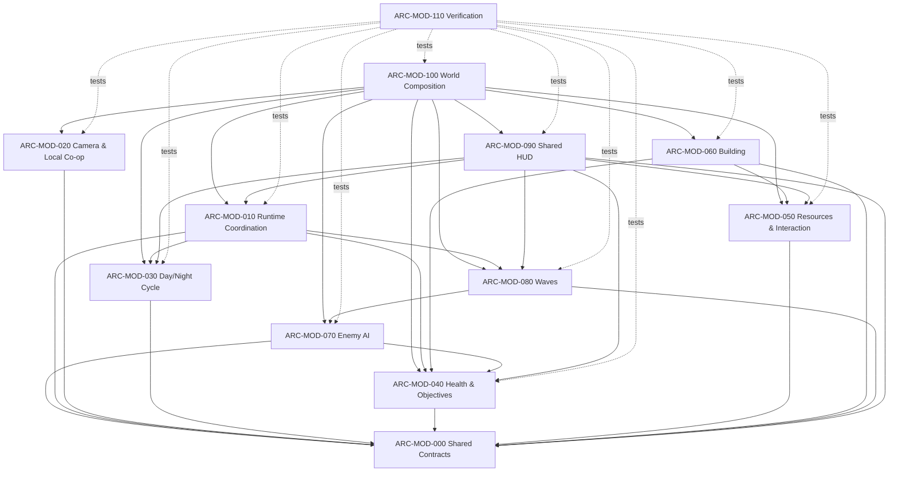
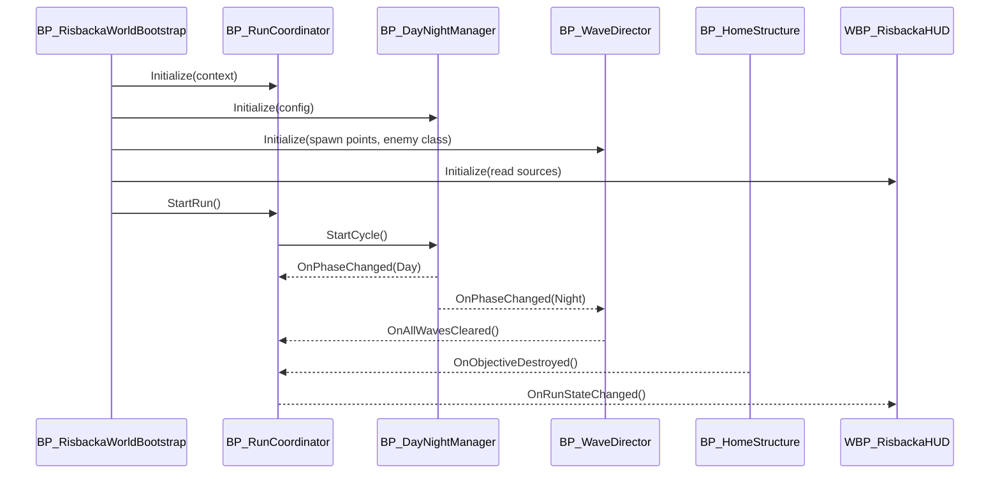

# System and Dependency Map

[Architecture home](README.md) · [Actor matrix](Actor-Module-Matrix.md) ·
[Feature crosswalk](Feature-Task-Crosswalk.md)

## Runtime Dependency Direction

Arrows mean “depends on.” Modules may depend downward but should not create a reverse
dependency.

## Allowed Dependency Table

| Consumer | Allowed providers | Forbidden direct knowledge |
|---|---|---|
| [Runtime](Modules/ARC-MOD-010-runtime.md) | Contracts, cycle, objective/player/wave signals | HUD widgets, AI graphs, storage internals |
| [Camera](Modules/ARC-MOD-020-camera-coop.md) | Camera participant contract | Resources, waves, health |
| [Cycle](Modules/ARC-MOD-030-cycle.md) | Shared contracts | Wave implementation, HUD |
| [Health](Modules/ARC-MOD-040-health-objectives.md) | Shared contracts | Run coordinator and HUD |
| [Resources](Modules/ARC-MOD-050-resources-interaction.md) | Health/damage and carry contracts | Building preview and HUD |
| [Building](Modules/ARC-MOD-060-building.md) | Resource store, health/damage | Concrete wood-storage graph |
| [Enemy AI](Modules/ARC-MOD-070-enemy-ai.md) | Objective and damage contracts | Run coordinator, wave schedule, HUD |
| [Waves](Modules/ARC-MOD-080-waves.md) | Wave accounting, configurable enemy class | Concrete boar behavior, cycle clock internals |
| [HUD](Modules/ARC-MOD-090-ui.md) | Read-only functions and dispatchers | Gameplay mutation and Tick polling |
| [Composition](Modules/ARC-MOD-100-composition.md) | Concrete top-level system references | Feature business logic |

## Event Flow for One Run

Only one terminal signal wins. `BP_RunCoordinator` ignores later success/failure
requests after entering a terminal state.

## Circular-Dependency Check

The following are architecture failures:

- Home calls GameMode to fail the run.
- Boar calls WaveDirector by searching the world.
- Fence casts to `BP_WoodStorage` instead of using the resource-store contract.
- HUD calls commands that mutate gameplay state.
- DayNightManager directly starts concrete boar spawns.
- Feature actors discover each other independently after composition.
